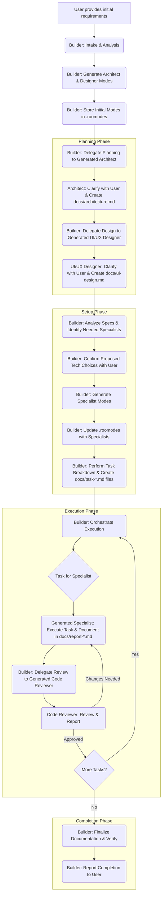

# Roo-Code Builder Mode Documentation

## 1. Purpose

The **Builder** mode is a highly adaptable and intelligent project lead designed for the Roo-Code VSCode extension. Its primary purpose is to serve as the central orchestrator for software development projects, moving away from a static set of predefined specialist modes towards a dynamic, project-specific approach.

The Builder analyzes initial requirements, facilitates detailed planning and user preference gathering (via dynamically generated Architect and Designer modes), generates a tailored team of specialist modes (like developers, database experts, reviewers) configured precisely for the project's needs, and manages the entire development workflow through to completion, ensuring quality and adherence to standards.

## 2. Overview

Instead of requiring the user to manually select and coordinate between various specialist modes, the Builder acts as the primary entry point. The user provides the initial project goal to the Builder, which then takes responsibility for:

1.  **Generating Initial Planning Team:** Creates project-specific System Architect and UI/UX Designer modes.
2.  **Delegating Planning:** Assigns detailed technical architecture and UI/UX design tasks to these generated modes.
3.  **Facilitating User Choices:** Ensures user preferences for technology stack, libraries, and tools are elicited and confirmed.
4.  **Generating Implementation Team:** Creates the necessary specialist modes (Frontend/Backend Developers, Database Expert, Code Reviewer, etc.) based on the finalized plans.
5.  **Defining Tasks:** Breaks down the project into appropriately sized, documented subtasks.
6.  **Orchestrating Execution:** Manages the workflow, delegates tasks to the generated specialists, enforces mandatory code reviews, and handles errors.
7.  **Ensuring Completion:** Oversees the project until all tasks are successfully completed and documented.

This dynamic approach ensures that the virtual team assembled is perfectly suited to the specific requirements and technology choices of each unique project.

## 3. Workflow Explained

The Builder follows a structured, multi-stage workflow:

**Step-by-Step Breakdown:**

1.  **Initial Intake:** Builder receives requirements, analyzes scope, and determines if it's a new or existing project.
2.  **Generate Architect Mode:** Builder creates a project-specific System Architect mode definition.
3.  **Generate UI/UX Designer Mode:** Builder creates a project-specific UI/UX Designer mode definition.
4.  **Store Initial Modes:** Builder writes the Architect and Designer definitions into the `.roomodes` file (JSON format).
5.  **Delegate Architecture:** Builder assigns the planning task to the generated Architect, providing all context. The Architect clarifies requirements sequentially with the user *before* documenting the full plan (including tech stack proposals/confirmations and overview) in `docs/architecture.md`. The Architect uses `attempt_completion` to report back.
6.  **Delegate UI/UX Design:** Builder assigns the design task to the generated Designer, providing context including the Architect's plan. The Designer clarifies requirements sequentially with the user *before* documenting the detailed design (wireframes, components, etc.) in `docs/ui-design.md`. The Designer uses `attempt_completion` to report back.
7.  **Analyze Specifications:** Builder reads and analyzes both `docs/architecture.md` and `docs/ui-design.md` to understand the complete plan.
8.  **Confirm Technology:** Builder identifies any *proposed* technology choices in the specs and uses `ask_followup_question` to get explicit user confirmation for each. Updates specs if needed.
9.  **Identify Specialists:** Builder determines which implementation modes (Frontend Dev, Backend Dev, DB Expert, Code Reviewer, etc.) are needed based on the confirmed plan.
10. **Generate Specialists:** Builder creates detailed definitions for each required specialist, injecting project-specific context, user-confirmed tool choices (with commands), best practices, documentation requirements, and the subtask completion protocol (`attempt_completion` only, no `switch_mode`).
11. **Update Mode Storage:** Builder adds the newly generated specialist definitions to the `.roomodes` JSON file.
12. **Task Breakdown:** Builder analyzes the overall plan, assesses complexity, applies a sizing strategy to define appropriately sized subtasks, maps dependencies, and creates detailed task definition files (`docs/task-[slug]-[task_number].md`) for every subtask.
13. **Orchestrate Execution:**
    *   Builder delegates tasks sequentially based on dependencies, instructing specialists to read their specific `docs/task-*.md` file.
    *   After each implementation task, Builder delegates a review to the generated Code Reviewer.
    *   Builder processes review feedback, potentially delegating fixes and re-reviews.
    *   Builder handles errors by delegating to a generated Debugger or consulting the user.
    *   Builder tracks progress (e.g., in `docs/progress.md`).
14. **Complete Project:** Once all tasks are done and reviewed, Builder verifies all documentation, ensures `docs/architecture.md` contains the overview, synthesizes results, and reports completion to the user via `attempt_completion`.

## 4. Key Features

*   **Dynamic Team Assembly:** Creates the exact set of virtual specialists needed for the project, avoiding unused modes.
*   **User-Centric Configuration:** Facilitates user preferences for technology stack, libraries, and package managers, ensuring the project aligns with user choices.
*   **Context-Aware Modes:** Generated modes receive highly specific instructions tailored to the project's architecture, design, and chosen tools.
*   **Structured Planning:** Leverages dynamically generated Architect and Designer modes for detailed, documented planning upfront.
*   **Formalized Task Management:** Implements systematic task breakdown, complexity assessment, dependency tracking, and documentation via dedicated task files.
*   **Integrated Quality Assurance:** Enforces a mandatory code review loop after every implementation task.
*   **Robust Error Handling:** Includes protocols for analyzing failures and involving a Debugger or the user for resolution.
*   **Documentation-Driven:** Emphasizes creating and utilizing documentation (`docs/` folder) at every stage.
*   **Standardized Output:** Generates mode definitions in the required JSON format for the `.roomodes` file.

## 5. How to Use

1.  **Activate Builder Mode:** Ensure the Builder mode is selected or active in your Roo-Code extension.
2.  **Provide Initial Request:** Clearly state your project goal or the modifications needed for an existing project. Include as much detail as possible about requirements, desired features, and any known constraints.
3.  **Engage in Clarification:** Be prepared to answer clarifying questions from the Builder itself (regarding project type) and subsequently from the generated System Architect and UI/UX Designer modes during their planning phases. Your input is crucial for technology selection and design direction.
4.  **Confirm Technology Choices:** If the Architect or Designer propose technology options (because you didn't specify a preference), the Builder will present these to you for explicit confirmation before proceeding.
5.  **Monitor Progress (Optional):** You can observe the process as the Builder delegates tasks and receives reports, potentially checking the `docs/` folder for generated plans, task files, and reports.
6.  **Provide Guidance on Errors:** If the Builder encounters unresolvable errors, it will ask for your guidance on how to proceed.

## 6. Configuration (`.roomodes`)

The Builder mode itself is defined within the `.roomodes` file (or a similar configuration file used by the Roo-Code extension). When a project starts, the Builder dynamically generates the definitions for the project-specific Architect and Designer modes and writes them to `.roomodes`. Later, it adds the generated specialist modes to this same file. This file allows the Roo-Code extension to recognize and utilize the dynamically created modes for the duration of the project.

## 7. Benefits

*   **Adaptability:** Creates the right team for any project, from simple scripts to complex applications.
*   **Tailored Expertise:** Generated modes are configured with project-specific context and toolchains.
*   **Consistency:** Enforces project standards (like package managers) and best practices across all generated modes.
*   **Efficiency:** Streamlines the workflow by automating delegation, task definition, and orchestration.
*   **Improved Quality:** Integrates mandatory code reviews and structured planning.
*   **User Control:** Keeps the user involved in key technology decisions.

This comprehensive documentation should provide a clear understanding of the Builder mode's capabilities and workflow.