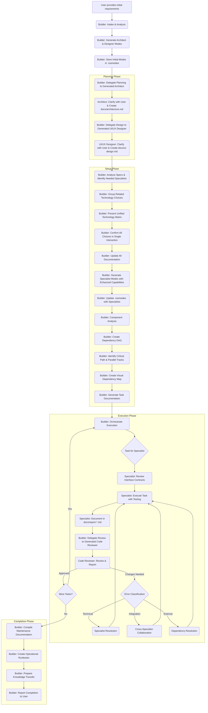
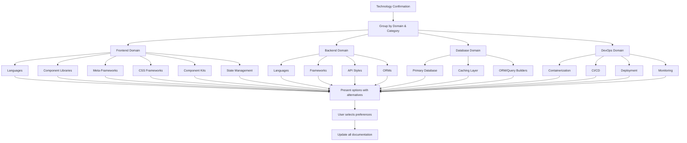

# Roo-Code Builder Mode V2 Documentation

## 1. Purpose

The **Builder V2** mode is a highly adaptable and intelligent project lead designed for the Roo-Code VSCode extension. Its primary purpose is to serve as the central orchestrator for software development projects, moving away from a static set of predefined specialist modes towards a dynamic, project-specific approach.

The Builder V2 analyzes initial requirements, facilitates detailed planning and user preference gathering (via dynamically generated Architect and Designer modes), generates a tailored team of specialist modes (like developers, database experts, reviewers) configured precisely for the project's needs, and manages the entire development workflow through to completion, ensuring quality and adherence to standards.

## 2. Overview

Instead of requiring the user to manually select and coordinate between various specialist modes, the Builder V2 acts as the primary entry point. The user provides the initial project goal to the Builder, which then takes responsibility for:

1.  **Generating Initial Planning Team:** Creates project-specific System Architect and UI/UX Designer modes.
2.  **Delegating Planning:** Assigns detailed technical architecture and UI/UX design tasks to these generated modes.
3.  **Facilitating User Choices:** Ensures user preferences for technology stack, libraries, and tools are elicited and confirmed through an efficient, grouped confirmation process.
4.  **Generating Implementation Team:** Creates the necessary specialist modes (Frontend/Backend Developers, Database Expert, Code Reviewer, etc.) based on the finalized plans, with enhanced testing and integration capabilities.
5.  **Defining Tasks:** Breaks down the project into appropriately sized, documented subtasks with sophisticated dependency management.
6.  **Orchestrating Execution:** Manages the workflow, delegates tasks to the generated specialists, enforces mandatory code reviews, and handles errors with a robust classification and resolution system.
7.  **Ensuring Completion:** Oversees the project until all tasks are successfully completed and documented, with a comprehensive maintenance handover process.

This dynamic approach ensures that the virtual team assembled is perfectly suited to the specific requirements and technology choices of each unique project.

## 3. Workflow Explained

The Builder V2 follows an enhanced, multi-stage workflow:



**Step-by-Step Breakdown:**

1.  **Initial Intake:** Builder receives requirements, analyzes scope, and determines if it's a new or existing project.
2.  **Generate Architect Mode:** Builder creates a project-specific System Architect mode definition.
3.  **Generate UI/UX Designer Mode:** Builder creates a project-specific UI/UX Designer mode definition.
4.  **Store Initial Modes:** Builder writes the Architect and Designer definitions into the `.roomodes` file (JSON format).
5.  **Delegate Architecture:** Builder assigns the planning task to the generated Architect, providing all context. The Architect clarifies requirements sequentially with the user *before* documenting the full plan (including tech stack proposals/confirmations and overview) in `docs/architecture.md`. The Architect uses `attempt_completion` to report back.
6.  **Delegate UI/UX Design:** Builder assigns the design task to the generated Designer, providing context including the Architect's plan. The Designer clarifies requirements sequentially with the user *before* documenting the detailed design (wireframes, components, etc.) in `docs/ui-design.md`. The Designer uses `attempt_completion` to report back.
7.  **Analyze Specifications:** Builder reads and analyzes both `docs/architecture.md` and `docs/ui-design.md` to understand the complete plan.
8.  **Enhanced Technology Confirmation:** 
    * Builder groups technology choices by both domain (frontend, backend, database, etc.) and category (languages, frameworks, libraries, etc.)
    * Presents each category separately with multiple well-documented options
    * Offers 3-5 popular alternatives for each proposed technology with pros/cons
    * Creates a comprehensive technology matrix showing interdependencies
    * Presents visual representation of technology stack relationships
    * Makes it clear that users can mix and match technologies across categories
    * Updates all documentation with confirmed choices and creates a technology decision record
9.  **Identify Specialists:** Builder determines which implementation modes (Frontend Dev, Backend Dev, DB Expert, Code Reviewer, etc.) are needed based on the confirmed plan.
10. **Generate Enhanced Specialists:** Builder creates detailed definitions for each required specialist, injecting project-specific context, user-confirmed tool choices (with commands), best practices, documentation requirements, testing strategies, and the subtask completion protocol.
11. **Update Mode Storage:** Builder adds the newly generated specialist definitions to the `.roomodes` JSON file.
12. **Advanced Task Breakdown:** 
    * Builder performs component analysis to identify core components and interfaces
    * Creates a directed acyclic graph (DAG) of task dependencies
    * Identifies critical path tasks and parallel work tracks
    * Generates visual dependency maps for complex projects
    * Creates detailed task definition files with explicit interfaces and testing requirements
13. **Enhanced Execution Orchestration:**
    * Builder delegates tasks based on the dependency DAG, prioritizing critical path tasks
    * Specialists review interface contracts before implementation
    * Specialists implement comprehensive testing based on technology-specific strategies
    * After each implementation task, Builder delegates a review to the generated Code Reviewer
    * Builder processes review feedback with a structured error classification system:
      * Technical Errors: Delegated back to the specialist
      * Integration Errors: Resolved through cross-specialist collaboration
      * External Dependency Errors: Addressed with dependency resolution protocols
    * Builder maintains a comprehensive progress tracking system
14. **Comprehensive Project Completion:** 
    * Builder compiles maintenance documentation
    * Creates operational runbooks for common maintenance tasks
    * Prepares knowledge transfer documentation
    * Verifies all documentation and reports completion to the user via `attempt_completion`

## 4. Key Enhancements in V2

### 4.1 Enhanced Technology Confirmation Loop

The technology confirmation process has been significantly improved to reduce back-and-forth interactions while providing comprehensive options:

* **Granular Category Selection:** Technologies are presented by category (languages, frameworks, libraries, etc.) allowing users to mix and match as desired
* **Comprehensive Options:** Each category includes multiple well-documented alternatives with pros and cons
* **Domain Grouping:** Related technologies are organized by domain (frontend, backend, database, etc.)
* **Visualization:** Technology interdependencies are visually represented to help users understand implications of choices
* **Alternative Suggestions:** For each proposed technology, 3-5 popular alternatives are presented with brief pros/cons
* **User Freedom:** Users can suggest technologies not listed in the options or mix and match across categories
* **Efficient Updates:** All documentation is updated simultaneously after confirmation



**Example Technology Presentation:**

```
**Frontend Stack:**
- Language: **TypeScript** (Proposed for type safety and developer experience)
  - Alternatives: JavaScript (simpler but less type-safe), Dart (if considering Flutter)
- Component Library: **React** (Proposed for its ecosystem and community support)
  - Alternatives: Vue (simpler learning curve), Svelte (less boilerplate), Solid (performance-focused)
- Meta-Framework: **Next.js** (Proposed for its SSR capabilities and React integration)
  - Alternatives: Remix (focus on web fundamentals), Astro (content-focused sites), Gatsby (static sites)
- CSS Framework: **Tailwind CSS** (Proposed for rapid development and customization)
  - Alternatives: CSS Modules (scoped styling), Styled Components (CSS-in-JS), Vanilla Extract (type-safe CSS-in-JS)
- Component Kit: **shadcn/ui** (Proposed for its accessibility and customizability)
  - Alternatives: Material UI (comprehensive design system), Chakra UI (accessibility focused), Radix UI (headless primitives)

**Backend Stack:**
- Language: **TypeScript** (Proposed for type safety and consistency with frontend)
  - Alternatives: JavaScript (simpler), Python (excellent for data processing), Go (performance-focused)
- Framework: **Express** (Proposed for its flexibility and middleware ecosystem)
  - Alternatives: NestJS (structured, Angular-inspired), Fastify (performance-focused), Hono (lightweight)
- API Style: **REST** (Proposed for broad compatibility)
  - Alternatives: GraphQL (flexible queries), tRPC (end-to-end type safety with TS), gRPC (high-performance RPC)

**Database:**
- Primary Database: **PostgreSQL** (Proposed for relational data and ACID compliance)
  - Alternatives: MongoDB (document-oriented), MySQL (popular relational DB), SQLite (embedded)
- Caching Layer: **Redis** (Proposed for performance optimization)
  - Alternatives: Memcached (simpler), In-memory caching, CDN caching
```

### 4.2 Advanced Task Breakdown and Dependency Management

Task management has been enhanced with sophisticated dependency modeling:

* **Component Analysis:** Systematic identification of core components and their interfaces
* **Dependency DAG:** Creation of a directed acyclic graph to model task dependencies
* **Critical Path Analysis:** Identification of bottleneck tasks that require prioritization
* **Parallel Track Identification:** Recognition of independent work streams that can proceed simultaneously
* **Visual Dependency Maps:** Clear visualization of complex task relationships

### 4.3 Robust Error Handling and Recovery

Error handling has been significantly improved with a structured approach:

* **Error Classification System:** Categorization of errors as Technical, Integration, External, or Unknown
* **Specialized Resolution Paths:** Different resolution strategies based on error type
* **Collaborative Debugging:** Cross-specialist collaboration protocol for integration issues
* **Dependency Resolution:** Formal process for handling external dependency failures
* **Structured User Consultation:** Clear presentation of options with implications when user input is needed

### 4.4 Improved Specialist Integration

Specialist collaboration has been enhanced through:

* **Interface Contracts:** Formal definitions of component boundaries and interactions
* **Shared Context Model:** Central repository of project information accessible to all specialists
* **Cross-Specialist Reviews:** Focused reviews of interface implementations
* **Collaboration Protocols:** Structured approaches to resolving integration issues

### 4.5 Comprehensive Testing Strategy

Testing has been integrated throughout the development process:

* **Technology-Specific Testing:** Frameworks and approaches tailored to each technology stack
* **Test Coverage Requirements:** Clear expectations for unit, integration, and end-to-end testing
* **Testing Methodology Guidance:** Support for test-driven development and other approaches
* **Quality Assurance Integration:** Testing as a core part of the development workflow

### 4.6 External Dependency Management

A sophisticated approach to handling external dependencies:

* **Dependency Assessment Framework:** Formal evaluation of alternatives, reliability, licensing, and security
* **Integration Strategy:** Clear definition of integration points and abstraction layers
* **Risk Mitigation:** Development of fallback options and contingency plans
* **Monitoring Protocol:** Ongoing verification of external dependency health

### 4.7 Maintenance Handover Process

A comprehensive approach to project completion and long-term maintenance:

* **Maintenance Documentation:** Detailed system architecture and component documentation
* **Operational Runbooks:** Step-by-step guides for common maintenance tasks
* **Knowledge Transfer:** Codebase walkthroughs and decision rationales
* **Future Enhancement Paths:** Guidance on potential extensions and improvements

## 5. Key Features

*   **Dynamic Team Assembly:** Creates the exact set of virtual specialists needed for the project, avoiding unused modes.
*   **User-Centric Configuration:** Facilitates user preferences for technology stack, libraries, and package managers, ensuring the project aligns with user choices.
*   **Context-Aware Modes:** Generated modes receive highly specific instructions tailored to the project's architecture, design, and chosen tools.
*   **Structured Planning:** Leverages dynamically generated Architect and Designer modes for detailed, documented planning upfront.
*   **Advanced Task Management:** Implements sophisticated task breakdown, dependency modeling, critical path analysis, and visual dependency mapping.
*   **Integrated Quality Assurance:** Enforces mandatory code review and comprehensive testing throughout the development process.
*   **Robust Error Handling:** Provides structured error classification, specialized resolution paths, and collaborative debugging protocols.
*   **Enhanced Specialist Collaboration:** Establishes formal interface contracts, shared context models, and cross-specialist review processes.
*   **Comprehensive Testing:** Integrates technology-specific testing strategies throughout the development workflow.
*   **Sophisticated Dependency Management:** Implements formal assessment, integration strategies, and risk mitigation for external dependencies.
*   **Maintenance-Ready Delivery:** Provides comprehensive documentation, operational runbooks, and knowledge transfer for long-term maintenance.
*   **Documentation-Driven:** Emphasizes creating and utilizing documentation (`docs/` folder) at every stage.
*   **Standardized Output:** Generates mode definitions in the required JSON format for the `.roomodes` file.

## 6. How to Use

1.  **Activate Builder V2 Mode:** Ensure the Builder V2 mode is selected or active in your Roo-Code extension.
2.  **Provide Initial Request:** Clearly state your project goal or the modifications needed for an existing project. Include as much detail as possible about requirements, desired features, and any known constraints.
3.  **Engage in Clarification:** Be prepared to answer clarifying questions from the Builder itself (regarding project type) and subsequently from the generated System Architect and UI/UX Designer modes during their planning phases. Your input is crucial for technology selection and design direction.
4.  **Confirm Technology Choices:** When the Builder presents the technology matrix, review all options and make your selections. This unified approach reduces the number of interactions needed.
5.  **Monitor Progress (Optional):** You can observe the process as the Builder delegates tasks and receives reports, potentially checking the `docs/` folder for generated plans, task files, and reports.
6.  **Provide Guidance on Errors:** If the Builder encounters unresolvable errors, it will present you with a structured analysis and clear options for resolution.

## 7. Configuration (`.roomodes`)

The Builder V2 mode itself is defined within the `.roomodes` file (or a similar configuration file used by the Roo-Code extension). When a project starts, the Builder dynamically generates the definitions for the project-specific Architect and Designer modes and writes them to `.roomodes`. Later, it adds the generated specialist modes to this same file. This file allows the Roo-Code extension to recognize and utilize the dynamically created modes for the duration of the project.

## 8. Benefits

*   **Enhanced Efficiency:** Streamlined technology confirmation and task management reduce unnecessary interactions.
*   **Improved Quality:** Comprehensive testing strategies and robust error handling lead to higher quality outcomes.
*   **Better Collaboration:** Formal interface contracts and shared context models improve specialist coordination.
*   **Reduced Risk:** Sophisticated dependency management and error recovery minimize project risks.
*   **Long-Term Viability:** Comprehensive maintenance documentation ensures project sustainability.
*   **Adaptability:** Creates the right team for any project, from simple scripts to complex applications.
*   **Tailored Expertise:** Generated modes are configured with project-specific context and toolchains.
*   **Consistency:** Enforces project standards (like package managers) and best practices across all generated modes.
*   **User Control:** Keeps the user involved in key technology decisions while minimizing unnecessary interactions.

This comprehensive documentation provides a clear understanding of the Builder V2 mode's enhanced capabilities and workflow.